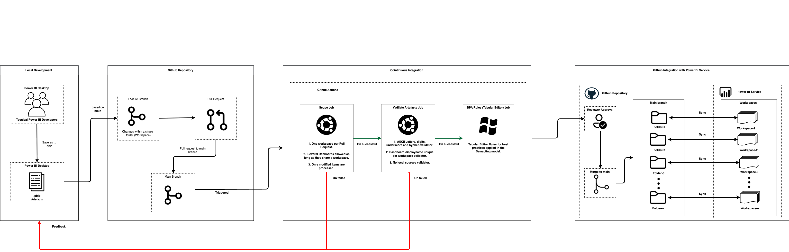

# solution-cicd-for-powerbi

Continuous integration and continuous delivery for Power BI Dashboard (PBIP Format).

One repository holds every workspace. A pull request that touches a
dashboard is validated before it can be merged, and merging makes the
change available to the workspace it belongs to through Fabric Git
Integration.

## Why this exists

Power BI development is hard to govern. Dashboards are built locally,
published by whoever holds a Pro license, and reviewed by nobody. The
cost lands on people who did not cause it: business users find the broken
refreshes, the capacity bill absorbs the poor modelling, and the few Pro
license holders absorb every mistake that reaches them.

At one workspace this is manageable by inspection. Across n workspaces,
with developers in several business areas, it is not — and without a
shared standard, each area diverges on naming, model structure and data
sources.

This pipeline moves the checks to the moment a change is proposed, where
the person who caused the problem can fix it in minutes.

## Architecture

### Environment constraints

Two facts about the environment shaped the design.

**Every workspace is production.** There is no dedicated development
workspace and no Dev → Test → Prod promotion path. A dashboard goes from
a developer's machine to the workspace business users consume.

Microsoft's lifecycle guidance asks for an isolated environment so
developers do not overwrite each other before committing, and names two
acceptable forms: a desktop tool, or a separate workspace. This project
relies on the first — development happens entirely in Power BI Desktop
against local files, and the workspace only ever receives content that
already passed review.

The consequence is that validation carries more weight than it would with
a test stage in front of it. There is no environment where a broken model
can fail harmlessly.

**N workspaces, one per business domain.** Sales, Finance, Marketing and
so on, each with its own developers and its own reviewer. 

### Proposed solution

A single repository holding every workspace, with delivery through Fabric
Git Integration and validation enforced at the pull request.

#### Fabric Git Integration as the delivery mechanism

Git Integration is [what Microsoft documents](https://learn.microsoft.com/en-us/fabric/cicd/git-integration/intro-to-git-integration)
for this shape of content: PBIP files in a repository, with workspaces
connected to it.

Three properties make it the right fit rather than merely a workable one:

- The repository is the source of truth and the workspace mirrors it, so
  what was reviewed is what ships
- Rollback is `git revert` plus a re-sync, not a manual rebuild
- Several workspaces can connect to the same branch, each to its own
  folder, which keeps the CI definition in one place instead of
  replicated across n branches

#### A monorepo, one folder per domain

`main` carries one folder per workspace, named after the business domain
it serves. Each Fabric workspace connects to the same branch but to its
own folder, and sees nothing outside it.

```
main
├── .github/                  pipeline definition, one copy
├── src/                      validation package and BPA rules
├── WORKSPACE_1/              ← Sales workspace syncs here
├── WORKSPACE_2/              ← Finance workspace syncs here
└── WORKSPACE_n/
```

The alternative was one branch per workspace, which Fabric also supports.
It was rejected because the CI definition would have to be replicated
across every branch and kept in sync by hand: a change to a validation
rule would mean n pull requests, each needing its own approval. The
branches would also diverge permanently, since nothing ever merges
between domains.

The monorepo makes three things possible that the branch-per-workspace
layout does not:

- **One pipeline definition.** A change to a validation rule ships once
  and applies to every domain immediately.
- **Ownership stays explicit.** `CODEOWNERS` maps each folder to its
  domain team, so a pull request routes to the right reviewer
  automatically.
- **Scope is a folder boundary.** Deciding which workspace a pull request
  touches is reading the first path segment of the diff, which is what
  makes the one-workspace-per-pull-request rule cheap to enforce.

The cost is that every domain shares a branch, so branch protection and
review discipline carry the isolation that separate branches would have
given for free. That is the trade being made deliberately.

#### Pipeline Architecture Diagram



Merging does not publish. Fabric detects the incoming change and someone
with a Pro license runs *Update from Git* in the workspace. That click is
the only manual step.

#### Project structure

```
solution-cicd-for-powerbi/
│
├── .github/
│   ├── actions/
│   │   └── uv_sync/
│   │       └── action.yaml           composite action, Python environment
│   └── workflows/
│       ├── powerbi_ci.yaml           orchestrator, triggered by pull request
│       ├── scope.yaml                reusable, resolves what changed
│       └── validate_powerbi.yaml     reusable, artefact checks
│
├── src/
│   ├── pbi_cicd/                     validation package
│   │   ├── models.py                 Item, ChangeSet, format constants
│   │   ├── infrastructure/
│   │   │   ├── errors.py             PbiCicdError, RuleViolation, PipelineError
│   │   │   ├── git.py                changed_files, deleted_files
│   │   │   └── output.py             job outputs, annotations, step summary
│   │   └── rules/
│   │       ├── scope.py              one workspace per PR, resolve changed items
│   │       ├── name.py               safe characters in item folder names
│   │       ├── identity.py           unique display names per workspace
│   │       ├── sources.py            no local paths in data sources
│   │       └── bpa.py                Best Practice Analyzer
│   │
│   └── tabula/
│       └── BPARules_by_name.json     Best Practice Analyzer rules
│
├── WORKSPACE_1/             one folder per Power BI workspace
│   ├── Dashboard_A.Report/
│   ├── Dashboard_A.SemanticModel/
│   └── .gitignore
├── WORKSPACE_2/
├── WORKSPACE_n/
│
├── pyproject.toml
├── uv.lock
└── README.md
```

## Validations

With no test environment in front of production, the pull request is the
only place a problem can be caught before a business user sees it. Every
pull request runs three jobs before it can be merged.

**Scope.** Resolves which items the pull request touched and enforces that
it stays within one workspace. Everything downstream consumes that scope,
so a pull request changing one dashboard validates one dashboard rather
than all of them — which is what keeps the pipeline usable as the number
of dashboards grows.

**Validate artefacts.** Three checks written in Python, ordered cheapest
first:

- **Item folder names** limited to ASCII letters, digits, underscore and
  hyphen. Accents and parentheses break the tooling downstream, and
  Microsoft documents that special characters in item names make Fabric
  autocorrect dependency paths — which surfaces as phantom uncommitted
  changes in a workspace nobody edited.
- **Display names unique** per workspace and item type. Fabric refuses to
  update a workspace holding two items of the same type with the same
  name, and offers no in-product repair: the update is blocked until
  someone renames an item.
- **No local paths in data sources.** A report reading from a file on a
  laptop publishes cleanly and fails on the first refresh, so the failure
  surfaces to a business user rather than to the author.

**BPA rules.** Tabular Editor's Best Practice Analyzer against rules
covering performance, DAX expressions, maintenance and error prevention.
This is the check that protects the capacity bill: missing date tables,
snowflake schemas and bi-directional relationships against
high-cardinality columns all cost money on every refresh, indefinitely.

Reporting only for now. Existing models violate hundreds of rules, so
blocking on them today would stop every dashboard from shipping. The
threshold is a parameter, not a rewrite.

Runs on a Windows runner: Tabular Editor 2 is a .NET Framework
application and does not run on Linux.

## Error handling

Every failure falls into one of two classes, and the distinction drives
how the message is written and who is expected to act on it.

| | `RuleViolation` | `PipelineError` |
| --- | --- | --- |
| Cause | The content of the pull request | Environment or configuration |
| Audience | The developer who opened it | Whoever maintains the pipeline |
| Fixed by | Editing the change | Fixing the repository or the workflow |
| Expected | Yes — this is the job working | No — this is the job broken |

Both inherit from `PbiCicdError`, which `main` catches. Anything else — a
`KeyError`, an `AttributeError` — propagates with its traceback rather
than being reported as a validation result. Those are bugs in the
pipeline, not findings about a dashboard.

Every message is emitted as a GitHub Actions annotation, so it lands on
the *Files changed* tab next to the offending file rather than buried in
the job log.

---

### RuleViolation

The author can fix all of these from Power BI Desktop.

#### Rule 1 — more than one workspace

```
[RuleViolation: 1] A pull request may only touch one workspace.
Found 2: WORKSPACE_1, WORKSPACE_2.
Split this into separate pull requests.
```

Each domain has its own reviewer and publishes independently. A change
spanning two waits on two approvals and can end up published in one
workspace and not the other.

`scope` fails before any other job runs, so nothing downstream executes.

#### Rule 4 — forbidden characters in a folder name

```
[RuleViolation: 4] SemanticModel folder 'Salés_Visual (1)' uses
characters that break the tools downstream. Rename it in Power BI Desktop
to something like 'Sales_Visual_1'. The name business users see
comes from displayName in .platform and is unaffected.
```

Annotated against each offending `.platform`, plus one summary line
listing every violation. The suggested replacement is generated by
folding accents to their ASCII base and collapsing everything else into
underscores, so `Análisis Ñoño` becomes `Analisis_Nono` rather than
losing letters.

The closing sentence is deliberate: it answers the first objection anyone
raises, which is whether the dashboard will lose its accents in the
portal. It will not — Fabric reads `displayName`, not the folder.

#### Rule 5 — duplicate display name

```
[RuleViolation: 5] Report 'Trimestal_Sales' has display name
'Sales Report', which is also used by Month_Report. Fabric refuses
to update a workspace holding two items of the same type with the same
name. Rename one of them in Power BI Desktop and export again.
```

Every member of a collision is annotated, not just one. Naming only the
newcomer would leave the author guessing what it collided with.

Typically caused by *Save As* on an existing project: the file name
changes but the report name inside Desktop does not.

#### Rule 6 — local data source

```
[RuleViolation: 6] Sales_Report reads from a Windows drive path:
Source = Csv.Document(File.Contents("C:\Users\user1\sales.csv"))
A path on a local machine does not exist in the Fabric service, so the
refresh fails and the dashboard shows up broken. Move the data to
SharePoint, Snowflake or a Delta table.
```

This is the violation with the worst failure mode if it slips through:
the dashboard publishes cleanly and looks correct, and the failure only
appears on the first refresh — to a business user, not to the author.

---

### PipelineError

None of these are the author's doing. They mean the pipeline could not
run, and they should be routed to whoever maintains it.

#### Incomplete export

```
Folder WORKSPACE_1/Sales.Report has no .platform.
It is not a valid Fabric item.
```
```
WORKSPACE_1/Sales.SemanticModel has no definition folder.
The semantic model export looks incomplete.
```

Almost always a partial copy: someone moved folders by hand rather than
uploading everything Power BI Desktop produced.

#### Unmappable paths

```
Files changed under a workspace folder but no item could be resolved.
Unmapped paths:
  WORKSPACE_1/documentacion/manual.pdf
```

This one exists specifically to prevent a false pass. A file sitting
directly under a workspace folder is legitimate — `.gitignore` lives
there — but anything deeper should have landed inside an item folder.
Failing to map it means either the layout is wrong or the resolution
logic broke.

Without this check the change set would come back empty, `has_changes`
would be false, every downstream job would skip, and the pull request
would go green having validated nothing.

#### Missing history

```
Reference 'origin/main' was not found in the local clone.
Check that actions/checkout uses fetch-depth: 0.
```

`actions/checkout` fetches a single commit by default, so the comparison
ref is absent and git returns an empty diff — indistinguishable from
"nothing changed". The check runs before every diff for exactly that
reason.


#### Tooling failures

```
The git executable was not found.
```
```
git diff --name-only ... has failed --->: fatal: bad revision
```
```
Could not launch C:\hostedtoolcache\windows\TabularEditor2\TabularEditor.exe
```
```
Analysis of Sales_Report did not finish within 10 minutes.
```

git's own stderr is preserved inside the message rather than replaced, so
the underlying cause survives. The Tabular Editor timeout prevents a
stalled model from occupying a runner indefinitely.

### Warnings

Warnings appear in the same place as errors and block nothing.

```
[Warning] Report 'DASHBOARD' was removed or renamed in workspace
'WORKSPACE_2'. It will disappear from the workspace on the
next update from Git.
```

Deleting an obsolete dashboard is legitimate, so it does not fail the
job. But with no deployment gate, a pull request that removes a workspace
would otherwise merge unnoticed. The reviewer should see it before
approving, not after someone reports a missing report.

Renames reach git as a delete plus an add, so an item listed here may
have been renamed rather than removed. The wording covers both.

## Local development

The validation package runs on the standard library, with no third-party
dependencies. Every module is a no-op outside Actions — `GITHUB_OUTPUT`
and `GITHUB_STEP_SUMMARY` are checked before writing — so the same
commands work unchanged on a laptop.

```bash
uv sync --locked

# resolve what a branch changed
uv run python -m pbi_cicd.rules.scope --base origin/main

# run a single rule
uv run python -m pbi_cicd.rules.name \
  --models '["WORKSPACE_1/Dashboard_A.SemanticModel"]' \
  --reports '["WORKSPACE_1/Dashboard_A.Report"]'

uv run python -m pbi_cicd.rules.identity --workspace WORKSPACE_1

uv run python -m pbi_cicd.rules.sources \
  --models '["WORKSPACE_1/Dashboard_A.SemanticModel"]'
```

### Adding a rule

1. New module under `src/pbi_cicd/rules/`, importing `Item` from `models`
   and the error classes from `infrastructure.errors`
2. Keep the checking function pure: strings in, findings out, no
   subprocess and no file access — that is what makes it testable
3. Annotate every offender, then raise once with a summary. The author
   should see every problem in one run rather than one per push
4. Add a step to `validate_powerbi.yaml` with `if: always()`, ordered
   after the cheaper checks
